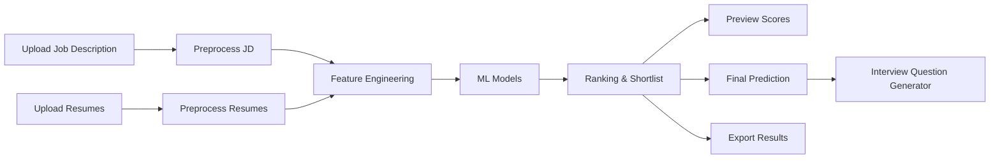
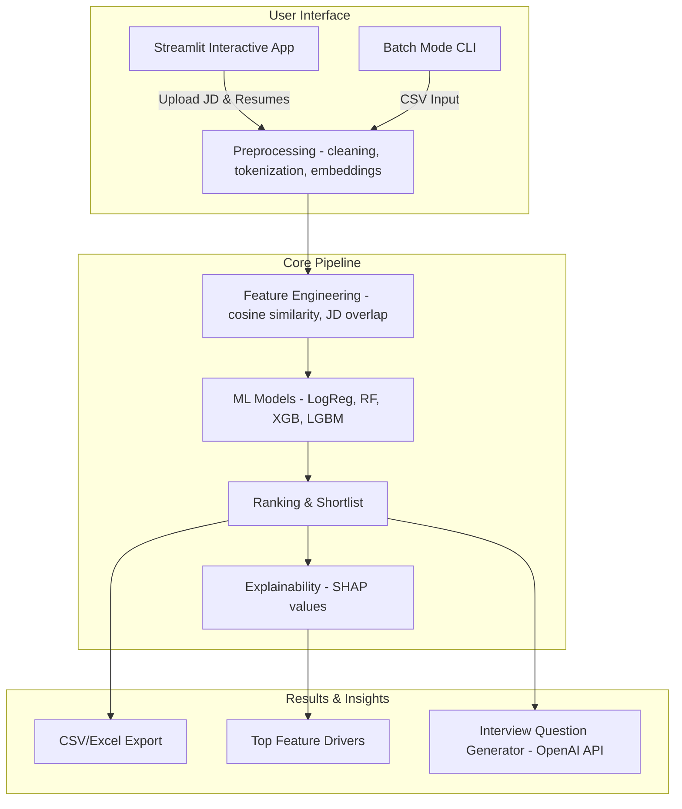

# Resume Ranker & Interview Question Generator

**Tagline:**  
*Rank smarter. Hire faster. Question better.*

---

## 1️⃣ Executive Summary — What & Why

Modern recruitment is **overwhelmed with resumes**.  
For a single job posting, recruiters may receive **hundreds or thousands of applications**, leading to:
- Long screening times
- Human bias in selection
- Missed strong candidates

This project — **Resume Ranker & Interview Question Generator** — addresses these pain points by combining **Machine Learning, Natural Language Processing, and Explainable AI** into a single system.

---

### What It Does
- **Ranks resumes** against a given Job Description (JD) using semantic similarity and ML classifiers.  
- **Shortlists top candidates** automatically with detailed scoring.  
- **Generates personalized interview questions** for each shortlisted candidate.  
- Provides **explainability** via SHAP to show *why* a resume was ranked a certain way.  

---

### Why It Matters
- **Efficiency**: Cuts resume screening time from hours to minutes.  
- **Fairness**: Data-driven ranking reduces human bias.  
- **Insightful**: SHAP-based explainability builds recruiter trust.  
- **Scalable**: Works in both interactive UI mode (Streamlit) and batch mode for bulk screening.  

---

### Outcomes & Highlights
- Dataset: **15,000 resumes across 29 categories** (preprocessed & labeled).  
- Models compared: Logistic Regression, Random Forest, SVM, XGBoost, LightGBM.  
- Metrics: Accuracy, Precision, Recall, F1, Balanced Accuracy, MCC.  
- **Random Forest** chosen as the most balanced & reliable model.  
- Integration with **OpenAI API** for intelligent, context-aware interview question generation.

---

### Key Results (from Experiments)
- **Balanced Accuracy Score Comparison**  
  

- **Precision vs Recall Scatter Plot**  
  

- **Matthews Correlation Coefficient (MCC) by Model**  
  %20by%20Model.png)

> Conclusion: **Random Forest** offered the most stable trade-off between precision and recall, making it the production choice.  

---

### System Snapshot
- **Interactive App**:  
  

- **Batch Mode**: supports scoring thousands of resumes vs multiple JDs at once.  

---

## 2️⃣ Demo Walkthrough — Recruiter Flow

The platform offers an **interactive Streamlit UI** and a **batch mode pipeline**.  
This walkthrough shows the recruiter’s journey step by step, reinforced with **screenshots** and a **flow diagram**.

---

### Recruiter Flow at a Glance

---

### 1. Main Screen
The recruiter lands on a simple, intuitive dashboard.  
From here, they can upload a Job Description (JD), add resumes, and generate results.  

*Screenshot:*  

---

### 2. Upload Job Description (JD)
Recruiters start by uploading the JD in text/CSV format.  
The system tokenizes and preprocesses it, extracting **key skills and requirements**.

*Screenshot:*  

---

### 3. Upload Resumes
Next, resumes are uploaded (PDF/Doc/CSV).  
The system performs **text cleaning, vectorization (TF-IDF/embeddings), and feature engineering**.

*Screenshot:*  

---

### 4. Preview & Semantic Similarity
Before final scoring, the recruiter can preview how resumes semantically align with the JD.  
A **similarity score** is calculated using cosine similarity + engineered features.

*Screenshot:*  

---

### 5. Shortlisted Candidates
Based on the ML ranking, the **top candidates** are shortlisted automatically.  
Recruiters see detailed scores and can export results (CSV/Excel).

*Screenshot:*  

---

### 6. Final Prediction
For each candidate, the system provides the final decision (Selected/Rejected) along with confidence metrics.

*Screenshot:*  

---

### 7. Generate Interview Questions
For each shortlisted candidate, the system uses **OpenAI-powered NLP** to generate **personalized interview questions** based on skills in the resume and requirements in the JD.

*Screenshot:*  

---

### 8. Batch Mode (Bulk Processing)
- **Script:** `streamlit_app_batch.py`  
- Input: CSV with thousands of resumes and multiple JDs.  
- Output: CSV with similarity scores, predictions, and shortlists.  
- Useful for enterprise-scale hiring.  

---

## 3️⃣ System Architecture — At a Glance

The **Resume Ranker Project** is built as an **end-to-end ML system** combining data pipelines, ML models, explainability, and a recruiter-friendly UI.  
It supports both **interactive mode (Streamlit app)** and **batch mode (CSV pipelines)**.

---

### 🖼️ High-Level Architecture

## How It Works (Step by Step)

### Input Layer (Recruiter Interaction)
- **Streamlit UI:** recruiter uploads a Job Description (JD) + resumes.  
- **Batch Mode CLI:** supports bulk CSVs for enterprise-scale hiring.  
- Both feed into the **preprocessing engine**.  

---

### Preprocessing Engine
- Cleans text: lowercasing, stopword removal, tokenization.  
- Vectorizes resumes & JDs using **TF-IDF** or **embeddings**.  
- Produces normalized feature vectors for downstream ML.  

---

### Feature Engineering
- **Cosine similarity:**
sim(u, v) = (u · v) / (||u|| * ||v||)
- **Keyword overlap** with JD (skills, technologies, verbs).  
- **Count-based features:** word frequencies, length normalization.  

---

### ML Models (Comparative)
- **Logistic Regression:** baseline linear classifier.  
- **Random Forest:** ensemble → best balance of precision/recall.  
- **XGBoost / LightGBM:** boosted trees → high accuracy, lower interpretability.  
- **SVM:** margin-based, strong for separable data.  
- Models trained & benchmarked; **Random Forest chosen for production**.  

---

### Ranking & Shortlist
- Candidates ranked by model output (**probability scores**).  
- Top-k shortlisted; final predictions (**Selected/Rejected**) generated.  

---

### Explainability (SHAP)
- **SHAP values** show which features drove the model decision.  
- Recruiter sees transparent insights (e.g., *“Python skill boosted score”*).  

---

### Outputs & Insights
- **Export:** CSV/Excel for HR workflows.  
- **Interview Question Generator:** uses OpenAI API to generate tailored questions based on JD–resume gaps.  
- **Explainability Report:** SHAP plots & feature contributions.  

---

### Technology Stack
- **Core ML/NLP:** Python 3, pandas, NumPy, scikit-learn, LightGBM, XGBoost, Random Forest, SHAP.  
- **Preprocessing:** NLTK/spaCy (stopwords, tokenization), TF-IDF vectorization, embeddings (BERT experiments in notebooks).  
- **UI:** Streamlit (interactive), CLI for batch mode.  
- **Explainability:** SHAP library for feature attribution.  
- **Interview Q Generation:** OpenAI GPT API (via `.env` API key).  
- **Artifacts:** Jupyter notebooks for data exploration, model training, experiments.  

---

### Why This Architecture?
- **Separation of concerns:** preprocessing, feature extraction, modeling, and explainability are modular.  
- **Scalability:** supports interactive mode for demos and batch mode for production-scale usage.  
- **Transparency:** SHAP values make “black-box” models interpretable → critical for hiring systems.  
- **Extensibility:** easy to plug in BERT embeddings or future LLM pipelines.  
