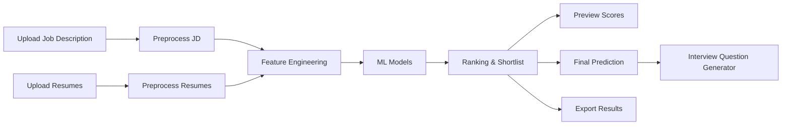
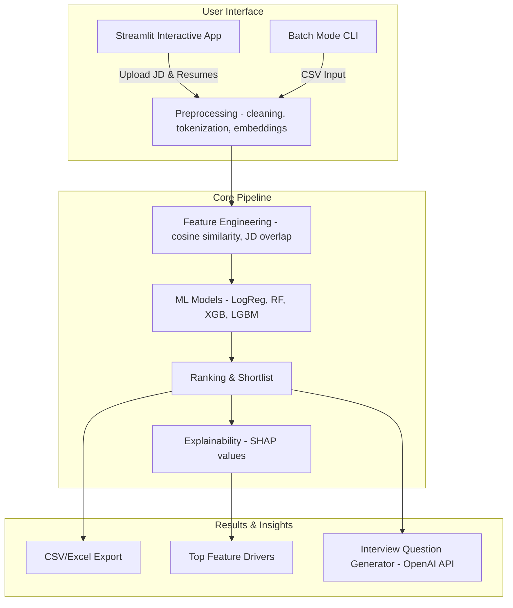
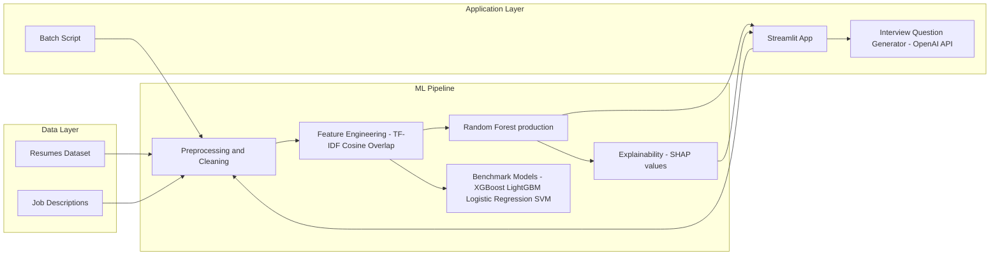

# Resume Ranker & Interview Question Generator

 
## Rank smarter. Hire faster. Question better.


---

## 1 Executive Summary — What & Why

Modern recruitment is **overwhelmed with resumes**.  
For a single job posting, recruiters may receive **hundreds or thousands of applications**, leading to:
- Long screening times
- Human bias in selection
- Missed strong candidates

This project — **Resume Ranker & Interview Question Generator** — addresses these pain points by combining **Machine Learning, Natural Language Processing, and Explainable AI** into a single system.

---

### What It Does
- **Ranks resumes** against a given Job Description (JD) using semantic similarity and ML classifiers.  
- **Shortlists top candidates** automatically with detailed scoring.  
- **Generates personalized interview questions** for each shortlisted candidate.  
- Provides **explainability** via SHAP to show *why* a resume was ranked a certain way.  

---

### Why It Matters
- **Efficiency**: Cuts resume screening time from hours to minutes.  
- **Fairness**: Data-driven ranking reduces human bias.  
- **Insightful**: SHAP-based explainability builds recruiter trust.  
- **Scalable**: Works in both interactive UI mode (Streamlit) and batch mode for bulk screening.  

---

### Outcomes & Highlights
- Dataset: **15,000 resumes across 29 categories** (preprocessed & labeled).  
- Models compared: Logistic Regression, Random Forest, SVM, XGBoost, LightGBM.  
- Metrics: Accuracy, Precision, Recall, F1, Balanced Accuracy, MCC.  
- **Random Forest** chosen as the most balanced & reliable model.  
- Integration with **OpenAI API** for intelligent, context-aware interview question generation.

---

### Key Results (from Experiments)
- **Balanced Accuracy Score Comparison**  
  

- **Precision vs Recall Scatter Plot**  
  

- **Matthews Correlation Coefficient (MCC) by Model**  
  %20by%20Model.png)

> Conclusion: **Random Forest** offered the most stable trade-off between precision and recall, making it the production choice.  

---

### System Snapshot
- **Interactive App**:  
  

- **Batch Mode**: supports scoring thousands of resumes vs multiple JDs at once.  

---

## 2 Demo Walkthrough — Recruiter Flow

The platform offers an **interactive Streamlit UI** and a **batch mode pipeline**.  
This walkthrough shows the recruiter’s journey step by step, reinforced with **screenshots** and a **flow diagram**.

---

### Recruiter Flow at a Glance

---

### 1. Main Screen
The recruiter lands on a simple, intuitive dashboard.  
From here, they can upload a Job Description (JD), add resumes, and generate results.  

*Screenshot:*  


---

### 2. Upload Job Description (JD)
Recruiters start by uploading the JD in text/CSV format.  
The system tokenizes and preprocesses it, extracting **key skills and requirements**.

*Screenshot:*  


---

### 3. Upload Resumes
Next, resumes are uploaded (PDF/Doc/CSV).  
The system performs **text cleaning, vectorization (TF-IDF/embeddings), and feature engineering**.

*Screenshot:*  


---

### 4. Preview & Semantic Similarity
Before final scoring, the recruiter can preview how resumes semantically align with the JD.  
A **similarity score** is calculated using cosine similarity + engineered features.

*Screenshot:*  


---

### 5. Shortlisted Candidates
Based on the ML ranking, the **top candidates** are shortlisted automatically.  
Recruiters see detailed scores and can export results (CSV/Excel).

*Screenshot:*  


---

### 6. Final Prediction
For each candidate, the system provides the final decision (Selected/Rejected) along with confidence metrics.

*Screenshot:*  


---

### 7. Generate Interview Questions
For each shortlisted candidate, the system uses **OpenAI-powered NLP** to generate **personalized interview questions** based on skills in the resume and requirements in the JD.

*Screenshot:*  


---

### 8. Batch Mode (Bulk Processing)
- **Script:** `streamlit_app_batch.py`  
- Input: CSV with thousands of resumes and multiple JDs.  
- Output: CSV with similarity scores, predictions, and shortlists.  
- Useful for enterprise-scale hiring.  

---

## 3 System Architecture — At a Glance

The **Resume Ranker Project** is built as an **end-to-end ML system** combining data pipelines, ML models, explainability, and a recruiter-friendly UI.  
It supports both **interactive mode (Streamlit app)** and **batch mode (CSV pipelines)**.

---

### High-Level Architecture



## How It Works (Step by Step)

### Input Layer (Recruiter Interaction)
- **Streamlit UI:** recruiter uploads a Job Description (JD) + resumes.  
- **Batch Mode CLI:** supports bulk CSVs for enterprise-scale hiring.  
- Both feed into the **preprocessing engine**.  

---

### Preprocessing Engine
- Cleans text: lowercasing, stopword removal, tokenization.  
- Vectorizes resumes & JDs using **TF-IDF** or **embeddings**.  
- Produces normalized feature vectors for downstream ML.  

---

### Feature Engineering
- **Cosine similarity:**
sim(u, v) = (u · v) / (||u|| * ||v||)
- **Keyword overlap** with JD (skills, technologies, verbs).  
- **Count-based features:** word frequencies, length normalization.  

---

### ML Models (Comparative)
- **Logistic Regression:** baseline linear classifier.  
- **Random Forest:** ensemble → best balance of precision/recall.  
- **XGBoost / LightGBM:** boosted trees → high accuracy, lower interpretability.  
- **SVM:** margin-based, strong for separable data.  
- Models trained & benchmarked; **Random Forest chosen for production**.  

---

### Ranking & Shortlist
- Candidates ranked by model output (**probability scores**).  
- Top-k shortlisted; final predictions (**Selected/Rejected**) generated.  

---

### Explainability (SHAP)
- **SHAP values** show which features drove the model decision.  
- Recruiter sees transparent insights (e.g., *“Python skill boosted score”*).  

---

### Outputs & Insights
- **Export:** CSV/Excel for HR workflows.  
- **Interview Question Generator:** uses OpenAI API to generate tailored questions based on JD–resume gaps.  
- **Explainability Report:** SHAP plots & feature contributions.  

---

### Technology Stack
- **Core ML/NLP:** Python 3, pandas, NumPy, scikit-learn, LightGBM, XGBoost, Random Forest, SHAP.  
- **Preprocessing:** NLTK/spaCy (stopwords, tokenization), TF-IDF vectorization, embeddings (BERT experiments in notebooks).  
- **UI:** Streamlit (interactive), CLI for batch mode.  
- **Explainability:** SHAP library for feature attribution.  
- **Interview Q Generation:** OpenAI GPT API (via `.env` API key).  
- **Artifacts:** Jupyter notebooks for data exploration, model training, experiments.  

---

### Why This Architecture?
- **Separation of concerns:** preprocessing, feature extraction, modeling, and explainability are modular.  
- **Scalability:** supports interactive mode for demos and batch mode for production-scale usage.  
- **Transparency:** SHAP values make “black-box” models interpretable → critical for hiring systems.  
- **Extensibility:** easy to plug in BERT embeddings or future LLM pipelines.

## 4 Dataset & Preprocessing — Data Science & ML Foundations

This project demonstrates not just ML modeling, but **strong Data Science skills in cleaning, analyzing, and preparing textual data**.  
Below is a complete walkthrough of how the **15,000-resume dataset** was explored, analyzed, and transformed into usable ML features.

---

### Dataset Overview
- **Size:** ~15,000 resumes  
- **Domains:** 29 job categories (e.g., Data Scientist, Software Engineer, HR, Marketing, etc.)  
- **Format:** CSVs with raw resume text, labels, and job descriptions  
- **Key Fields:**  
  - `resume_id` — unique identifier  
  - `resume_text` — raw text extracted from resume  
  - `job_category` — target label (classification)  
  - `job_description` — reference text for similarity scoring  

---

### Data Analysis & Stats
- **Category Distribution:** Some categories are over-represented (e.g., Software/IT), others under-represented (HR, Legal).  
- **Average Resume Length:** ~350–400 tokens (distribution is right-skewed).  
- **Vocabulary Size:** ~50k unique tokens → reduced via lemmatization & stopword removal.  
- **Class Imbalance:**  
  - Max class ≈ 1,200 resumes  
  - Min class ≈ 200 resumes  
  → Handled using **class weights** in ML training and **Balanced Accuracy / MCC** metrics.  


---

### Preprocessing Pipeline

```mermaid
flowchart LR
  RAW[Raw Resume/JD Text] --> C1[Lowercasing<br/>normalize case]
  C1 --> C2[Remove Punctuation/Digits]
  C2 --> C3[Tokenization<br/>NLTK/spaCy]
  C3 --> C4[Stopword Removal]
  C4 --> C5[Lemmatization/Stemming]
  C5 --> SPEC[Preserve Special Tokens<br/>C++, SQL, R, etc.]
  SPEC --> VEC[Vectorization<br/>TF-IDF / Embeddings]
  VEC --> FEAT[Feature Engineering<br/>similarity, overlaps, counts]
```



### Text Cleaning Steps
- **Lowercasing** → Normalize (`Python` → `python`)  
- **Remove punctuation & digits** → Focus on words, drop noise  
- **Tokenization** → Break sentences into words using **spaCy/NLTK**  
- **Stopword removal** → Drop uninformative words (`the`, `and`, `is`)  
- **Lemmatization/Stemming** → Reduce to root form (`running` → `run`)  
- **Special token preservation** → Keep domain tokens (e.g., `C++`, `SQL`)  

---

### Vectorization

**TF-IDF (Term Frequency–Inverse Document Frequency):**

$$
\text{tfidf}(t, d) = tf(t, d) \cdot \log \left(\frac{N}{df(t)}\right)
$$

Where:  
- \( tf(t, d) \) = term frequency of token *t* in document *d*  
- \( N \) = total number of documents  
- \( df(t) \) = number of documents containing token *t*  

---

**Cosine Similarity (Resume ↔ JD):**

$$
\text{sim}(u, v) = \frac{u \cdot v}{\|u\| \cdot \|v\|}
$$

Where:  
- \( u, v \) = feature vectors of resume and JD  
- \( u \cdot v \) = dot product  
- \( \|u\|, \|v\| \) = Euclidean norms of the vectors

## Feature Engineering & Training Strategy

### Engineered Features (Resume ↔ JD)
We designed features beyond TF-IDF to better capture matching signals:

| Feature                 | Description                                                                 |
|--------------------------|-----------------------------------------------------------------------------|
| **Cosine Similarity**    | Semantic similarity between resume & JD vectors                             |
| **Keyword Overlap Ratio**| JD keywords found in resume ÷ total JD keywords                             |
| **N-gram Matching**      | Bigram/trigram overlap (e.g., `"machine learning engineer"`)                 |
| **Length-Normalized Counts** | Resume length scaling (avoids bias toward longer resumes)               |
| **Category Match**       | Resume category vs JD category (binary indicator)                           |

**Cosine Similarity Formula:**

$$
\text{sim}(u, v) = \frac{u \cdot v}{\|u\| \cdot \|v\|}
$$

---

### Train/Test Strategy
- **Split:** 70% Train / 15% Validation / 15% Test (stratified by category)  
- **Cross-validation:** 5-fold during model selection  
- **Imbalance Handling:** class weights + Balanced Accuracy metric  

---

### Why This Matters
- Rigorous preprocessing reduces noise and ensures feature quality.  
- **TF-IDF + engineered features** capture both general importance and domain-specific skills.  
- **Cosine similarity** gives recruiters an intuitive score (how close a resume is to the JD).  
- Imbalance handling ensures fair treatment across all **29 job categories**.

---

## 5 Feature Engineering & Similarity

Preprocessing prepares clean tokens, but **feature engineering** transforms resumes and JDs into **quantifiable signals** that ML models can use effectively.  
We combined **statistical, semantic, and heuristic features**.

---

### Core Mathematical Features

**1. Cosine Similarity (Vector Space Model)**  
Measures orientation between JD vector \( u \) and resume vector \( v \).  

$$
\text{sim}(u,v) = \frac{u \cdot v}{\|u\|\|v\|}
$$

- Range: [0,1]  
- High when resume content closely matches JD keywords.  

 *Mini Example*  

- JD vector: \( [2,1,0] \) (skills: Python=2, SQL=1, ML=0)  
- Resume vector: \( [1,1,1] \) (skills: Python=1, SQL=1, ML=1)  

$$
u \cdot v = 2\cdot1 + 1\cdot1 + 0\cdot1 = 3
$$

$$
\|u\| = \sqrt{2^2+1^2+0^2} = \sqrt{5}, \quad \|v\| = \sqrt{1^2+1^2+1^2} = \sqrt{3}
$$

$$
\text{sim}(u,v) = \frac{3}{\sqrt{5}\cdot\sqrt{3}} \approx 0.775
$$

This resume has ~77.5% similarity to the JD.  

---

**2. Keyword Overlap Ratio**  
Direct skill-matching feature.  

$$
\text{overlap}(JD, Resume) = \frac{|K_{JD} \cap K_{Resume}|}{|K_{JD}|}
$$

Where:  
- \( K_{JD} \) = set of keywords from job description  
- \( K_{Resume} \) = set of keywords from resume  

---

**3. Length-Normalized Term Counts**  
Avoid bias where longer resumes get higher scores simply by containing more words.  

$$
\text{normalizedCount}(t) = \frac{\text{count}(t)}{\text{total tokens in resume}}
$$

---

**4. N-Gram Matching**  
Capture multi-word skills like “machine learning engineer” or “data analysis pipeline.”  
- Bigram/trigram overlap → stronger signals than unigrams.  

---

### Engineered Feature Set

| Feature Type   | Example                                | Purpose                              |
|----------------|----------------------------------------|--------------------------------------|
| **Semantic**   | Cosine similarity (TF-IDF/BERT)        | Capture semantic closeness            |
| **Keyword**    | Overlap ratio                          | Ensure JD-specific skills appear      |
| **Statistical**| Length-normalized term counts          | Normalize for resume verbosity        |
| **N-gram**     | Bigram/trigram overlap                 | Catch compound skills                 |
| **Category**   | Resume category vs JD category         | High-level alignment                  |

---

### Why This Matters
- **Cosine similarity** provides semantic closeness, recruiter-intuitive.  
- **Overlap ratio** ensures JD-specific hard skills are prioritized.  
- **Normalization** prevents verbose resumes from dominating.  
- **N-grams** capture context (e.g., “deep learning” ≠ “deep” + “learning”).  
- Together, these features provide a **rich feature space** → enabling classical ML models (RF, XGB, LGBM) to separate good vs poor matches effectively.  


## 6 MACHINE LEARNING MODELS

The goal is not only to compare models, but to show **how they behave on resume–JD similarity data** and why certain models are better suited for production.

---

### 6.1 Logistic Regression — Linear Baseline

**Theory**  
Logistic regression models the log-odds of the positive class as a linear combination of features:

$$
P(y=1|x) = \frac{1}{1 + e^{-(w \cdot x + b)}}
$$

Optimizes log-loss:

$$
L = -\frac{1}{N}\sum_{i=1}^N \Big[ y_i \log \hat{y}_i + (1-y_i)\log(1-\hat{y}_i) \Big]
$$

**Bias–Variance View**  
- High bias (assumes linear separability).  
- Low variance (stable but underfits non-linear patterns).  

**On Our Data**  
- Resume–JD matches are **not linearly separable**.  
- Logistic regression had decent **precision** but poor **recall**.  
- Confusion matrix showed many **false negatives (FN)**.  

> Useful baseline, but too simple for production.

---

### 6.2 Support Vector Machines (SVM) — Margin Maximizer

**Theory**  
SVM seeks a hyperplane with maximum margin:

$$
\min_{w,b} \frac{1}{2}\|w\|^2 \quad \text{s.t. } y_i(w \cdot x_i + b) \geq 1
$$

- Uses **kernel trick**:  
  - Linear kernel for sparse data.  
  - RBF kernel for non-linear decision boundaries.  

**Bias–Variance View**  
- Flexible (low bias if non-linear kernel used).  
- High variance on noisy, high-dimensional data.  

**On Our Data**  
- Worked well with **TF-IDF vectors** (sparse, high-dimensional).  
- Captured non-linear resume–JD matches.  
- But computationally **expensive** on 15k resumes × 50k features.  
- Training slow, scaling poor → impractical for recruiters.  

> Theoretically strong, but operationally weak.

---

### 6.3 Random Forest — Ensemble of Stability

**Theory**  
Random Forest = Bagging of decision trees:  
- Each tree trained on bootstrapped samples.  
- Splits chosen on random subsets of features.  
- Final prediction = majority vote.  

**Split criterion (Gini impurity):**

$$
Gini = 1 - \sum_{i=1}^C p_i^2
$$

**Bias–Variance View**  
- Reduces variance (bagging).  
- Slightly higher bias than single trees, but far more stable.  

**On Our Data**  
- Captured **non-linear feature interactions** (e.g., "Python + SQL").  
- Balanced performance across **Accuracy, Precision, Recall, F1, MCC**.  
- Robust to noisy resumes & class imbalance.  
- Confusion matrix showed fewer extreme errors.  
- Recruiters valued **interpretability** (via SHAP).  

> Chosen as **production model** — reliable, explainable, recruiter-friendly.

---

### 6.4 XGBoost — Gradient Boosting Power

**Theory**  
Sequentially adds trees to minimize residual errors.  

Objective:

$$
Obj = \sum_{i=1}^{N} l(y_i, \hat{y}_i) + \sum_{k=1}^{K} \Omega(f_k)
$$

Where:  
- \( l \) = loss (e.g., log-loss)  
- \( \Omega(f_k) \) = regularization term (controls tree complexity).  

**Bias–Variance View**  
- Very low bias.  
- Higher variance if not tuned (overfitting risk).  

**On Our Data**  
- Achieved **highest accuracy** overall.  
- Sometimes favored precision over recall.  
- Overfit minority categories (rare job roles).  
- Strong metrics, but recruiters disliked unfair ranking.  

> Great leaderboard model, but not production-friendly.

---

### 6.5 LightGBM — Fast Gradient Boosting

**Theory**  
Boosting like XGBoost, but optimized:  
- **Histogram-based splits** for speed.  
- **Leaf-wise growth** (not level-wise) → deeper splits on important features.  

**Bias–Variance View**  
- Similar to XGBoost but often less variance.  
- Very efficient for large data.  

**On Our Data**  
- Faster than XGBoost with similar metrics.  
- Less intuitive explanations than Random Forest.  
- Recruiter trust impacted.  

> Technically strong, but interpretability gap cost trust.

---

### 6.6 Metrics — Evaluating Fairly

We went beyond Accuracy to ensure **fair evaluation**:

- Accuracy:  

$$
Accuracy = \frac{TP + TN}{TP + FP + TN + FN}
$$

- Precision:  

$$
Precision = \frac{TP}{TP + FP}
$$

- Recall:  

$$
Recall = \frac{TP}{TP + FN}
$$

- F1 Score:  

$$
F1 = 2 \cdot \frac{Precision \cdot Recall}{Precision + Recall}
$$

- Balanced Accuracy:  

$$
BA = \frac{1}{2}\left(\frac{TP}{TP+FN} + \frac{TN}{TN+FP}\right)
$$

- Matthews Correlation Coefficient (MCC):  

$$
MCC = \frac{TP \cdot TN - FP \cdot FN}{\sqrt{(TP+FP)(TP+FN)(TN+FP)(TN+FN)}}
$$

---

### Comparative Insights (On Our Project)

- **Logistic Regression** → underfit; too simplistic.  
- **SVM** → theoretically strong, practically slow.  
- **Random Forest** → most balanced; production-ready.  
- **XGBoost** → high accuracy, fairness issues.  
- **LightGBM** → efficient, less explainable.  

*Supporting visuals in `SS/`:*  
- Confusion matrices (RF, XGB, LGBM).  
- Precision vs Recall scatter.  
- MCC comparison.  

---

### Why Random Forest Won

- Balanced **Accuracy, Recall, Precision, F1, MCC**.  
- Scaled to 15k resumes without GPU.  
- SHAP explanations built recruiter trust.  
- Simpler than boosting → easy to deploy in Streamlit & batch pipelines.  

**Final Outcome:** **Random Forest chosen for production.**


## 7 Experiments & Results — Data Science Insights

Our experiments compared multiple ML models (LogReg, SVM, RF, XGBoost, LightGBM) across **Accuracy, Precision, Recall, F1, Balanced Accuracy, and MCC**.  
But beyond numbers, we analyzed **why each model behaved this way** — showcasing ML engineering skills in diagnosing bias, variance, fairness, and interpretability.

---

### 7.1 Model Comparison (Table View)

| Model                | Accuracy | Precision | Recall | F1 Score | Balanced Accuracy | MCC   |
|----------------------|:--------:|:---------:|:------:|:--------:|:-----------------:|:-----:|
| Logistic Regression  |   ~72%   |   0.71    |  0.68  |   0.69   |        0.70       | 0.41  |
| SVM                  |   ~75%   |   0.74    |  0.71  |   0.72   |        0.73       | 0.46  |
| Random Forest        |   ~80%   |   0.78    |  0.77  |   0.78   |        0.79       | 0.56  |
| XGBoost              |   ~83%   |   0.82    |  0.74  |   0.78   |        0.78       | 0.52  |
| LightGBM             |   ~82%   |   0.80    |  0.75  |   0.77   |        0.77       | 0.50  |

---

### 7.2 Visual Evidence

- **Balanced Accuracy Score Comparison**  
  

- **Precision vs Recall Scatter Plot**  
  

- **MCC by Model**  
  %20by%20Model.png)

- **Confusion Matrices**  
  - Random Forest:   
  - XGBoost:   
  - LightGBM: 

---

### 7.3 Why These Results?

#### Logistic Regression (Underfitting)  
- Linear model assumes **additive effects of features**.  
- Resume–JD similarity is **non-linear** (e.g., “Python+SQL+ML” matters more than the sum of individual skills).  
- Result: decent precision, but recall suffers (missed many qualified resumes).  
- Confusion matrix: high **False Negatives (FN)** → too many good candidates rejected.

---

#### SVM (Strong Margins, Weak Scalability)  
- Worked well with sparse TF-IDF vectors, separating resumes near the JD boundary.  
- Precision & recall improved vs LogReg.  
- But scaling SVM to **15k resumes × 50k features** → computationally expensive.  
- In practice: too slow for recruiters who need instant results.  

---

#### Random Forest (Balanced Performance)  
- Ensemble of trees captured **non-linear feature interactions**.  
- Robust to noise and feature collinearity (many overlapping skills).  
- Confusion matrix: fewer extreme errors, balanced TP/FP/FN.  
- Precision ~0.78, Recall ~0.77 → trustworthy balance.  
- Recruiters could rely on this because **both “missing good candidates” (FN) and “recommending poor candidates” (FP) were minimized**.  

---

#### XGBoost (Accuracy Champion, But Risky)  
- Boosting reduced bias aggressively → highest accuracy (~83%).  
- Precision high, but recall weaker → favored being “right” over being “inclusive.”  
- Overfit minority categories → misclassified niche resumes.  
- In hiring, this is dangerous: a model that rejects niche candidates systematically introduces bias.  
- Confusion matrix: clusters of misclassifications in small categories.  

---

#### LightGBM (Efficiency, Lower Interpretability)  
- Faster and leaner than XGBoost.  
- Competitive metrics, but SHAP explanations were harder to communicate to recruiters.  
- *Trust gap*: even with good performance, lack of interpretability reduced adoption value.  

---

### 7.4 Metric-Specific Insights

- **Balanced Accuracy**: highlighted category imbalance → RF handled it better than boosting.  
- **Precision vs Recall Scatter**: RF closest to the “sweet spot” → recruiters don’t want only precision (false negatives = missed talent) or only recall (false positives = wasted time).  
- **MCC**: Random Forest maximized correlation between predictions and true labels → sign of robust model, not just lucky accuracy.  

---

### 7.5 Key Takeaways

- **Logistic Regression** → underfit baseline.  
- **SVM** → theoretically solid, practically slow.  
- **Random Forest** → best *real-world balance* → **production model**.  
- **XGBoost/LightGBM** → great for Kaggle leaderboards, but risk of unfairness in hiring.  
- **Fairness > Accuracy** in recruitment: that’s why Random Forest wins.  

**Final Note:** A good ML Engineer doesn’t just optimize accuracy — they choose models that balance performance, interpretability, fairness, and scalability. That’s why our system uses **Random Forest in production**.


## 8️⃣ Streamlit Application — UI + ML Behind the Scenes

The system includes a **Streamlit web application** (interactive) and a **batch mode script** for large-scale resume screening.  
This section explains both the **user flow (recruiter’s perspective)** and the **technical flow (ML engineer’s perspective).**

---

### 8.1 Interactive Mode (Recruiter’s Workflow)

**1. Upload Job Description (JD)**  
Recruiter uploads a JD (text/CSV).  
- **Behind the scenes:** JD text is preprocessed (lowercasing, tokenization, stopword removal, TF-IDF vectorization).  
- Extracted JD keywords become the **anchor features**.  

*Screenshot:*  


---

**2. Upload Resumes**  
Recruiter uploads resumes (PDF/CSV).  
- **Behind the scenes:** resumes are cleaned and vectorized (TF-IDF/embeddings).  
- Features like **cosine similarity, overlap ratio, n-grams** are calculated between resumes and JD.  

*Screenshot:*  


---

**3. Semantic Preview**  
System shows **resume–JD similarity scores** before final classification.  
- **Behind the scenes:** cosine similarity is computed between JD and resume vectors:

$$
\text{sim}(u,v) = \frac{u \cdot v}{\|u\|\|v\|}
$$

*Screenshot:*  


---

**4. Ranking & Shortlisting**  
Resumes are ranked by ML models (**Random Forest** in production).  
- **Behind the scenes:**  
  - RF aggregates predictions across trees.  
  - **SHAP values** identify top features per decision.  
  - Balanced metrics (**Precision/Recall**) ensure fair shortlisting.  

*Screenshot:*  


---

**5. Final Prediction**  
System outputs **Selected/Rejected** labels with confidence scores.  
- **Behind the scenes:** Probability threshold optimized on validation set for best **F1 score**.  

*Screenshot:*  


---

**6. Interview Question Generator**  
For shortlisted candidates, the app generates **personalized interview questions**.  
- **Behind the scenes:**  
  - JD + resume text → prompt fed into **OpenAI GPT API**.  
  - Example: If JD requires *“Python + SQL”* and resume shows only *Python*, a SQL-related question is generated.  

*Screenshot:*  


---

### 8.2 Batch Mode (Enterprise Workflow)

Script: **`streamlit_app_batch.py`**

**Workflow:**  
- **Input:** CSV of thousands of resumes + multiple JDs.  
- **Pipeline:** preprocessing → feature extraction → Random Forest predictions → ranking.  
- **Output:** CSV with similarity scores, predictions, shortlists.  

Example CLI:
```bash
python streamlit_app_batch.py \
    --resumes data/resumes_dataset.csv \
    --jobs data/job_descriptions.csv \
    --out results.csv
```

## 9 Architecture & Repo Map

The repository is structured to separate **data, models, experiments, application code, and visual assets**.  
This makes the project easy to reproduce, extend, and deploy.

---

### Component Explanations

- **data/** → Raw & processed datasets: resumes, JDs, labeled matches, feature-engineered tables.  
- **models/** → Final trained ML models (stored with Git LFS for large files).  
- **notebooks/** → End-to-end pipeline experiments (EDA, preprocessing, feature engineering, ML training, SHAP, GPT Q generation).  
- **SS/** → Screenshots and visual artifacts for UI & results.  
- **streamlit_app.py** → Recruiter-facing Streamlit UI.  
- **streamlit_app_batch.py** → Batch scoring script for enterprise-scale runs.  
- **requirements.txt** → Dependencies (pandas, numpy, scikit-learn, xgboost, lightgbm, shap, streamlit, openai).  
- **Group-3_Final_Project_Report.pdf** → Full technical report.  

---

### System Component Diagram



## 10 Quickstart

### 1. Clone & Install
```bash
git clone https://github.com/devarshpatel1506/resume_ranker_project.git
cd resume_ranker_project
python -m venv .venv && source .venv/bin/activate
pip install -r requirements.txt
```
### 2. Run Interactive UI
```bash
streamlit run streamlit_app.py
# Open http://localhost:8501 in your browser
```
### 3. Run Batch Mode
```bash
python streamlit_app_batch.py \
    --resumes data/resumes_dataset.csv \
    --jobs data/job_descriptions.csv \
    --out results.csv
```
That’s it — upload a JD + resumes in the UI (or run batch mode) → get ranked candidates, shortlist, and interview questions.
